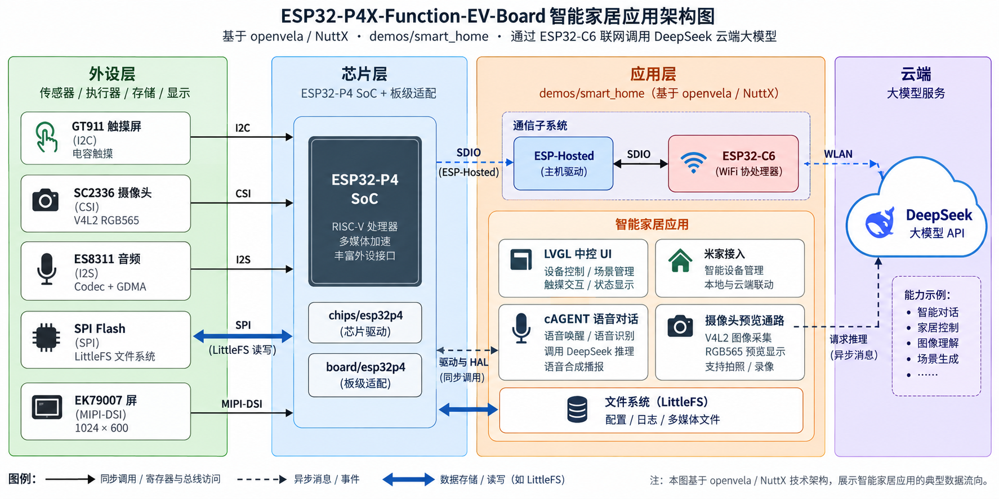
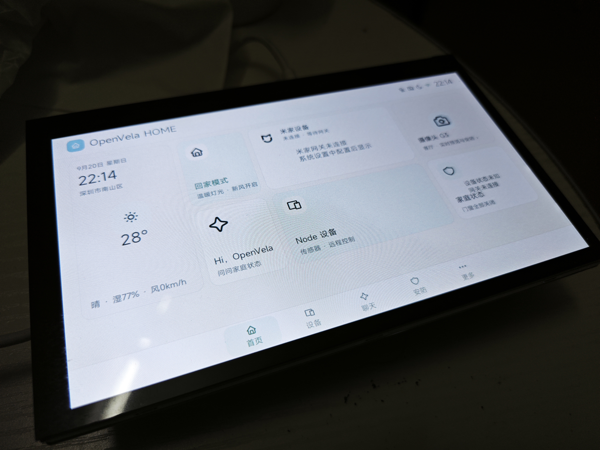
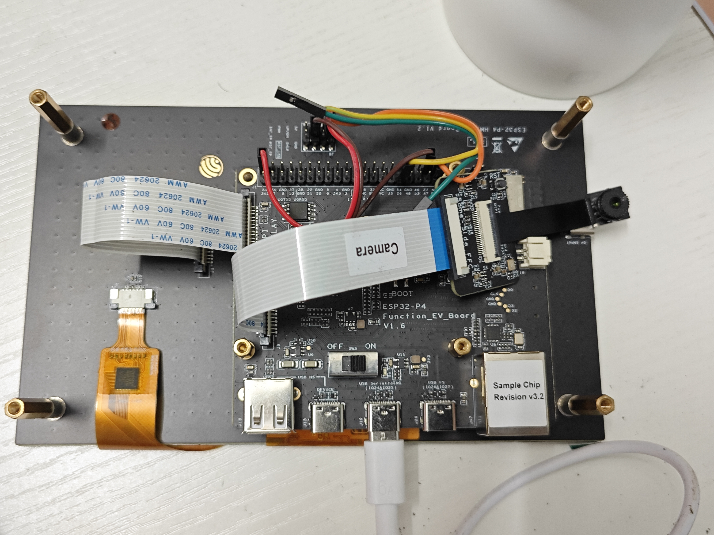
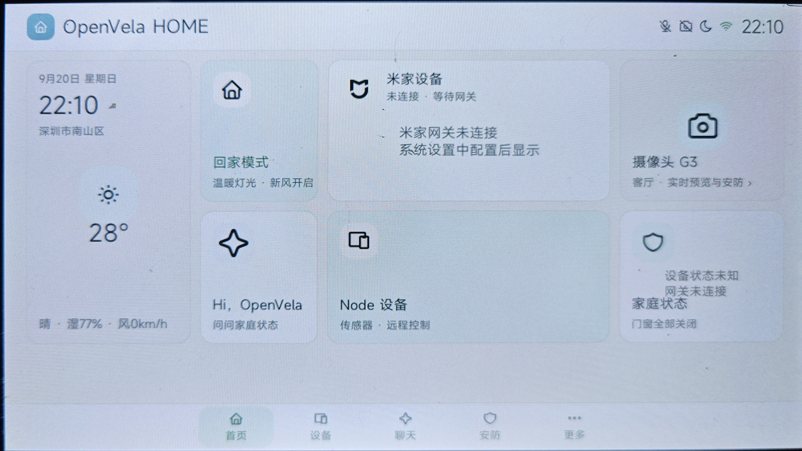
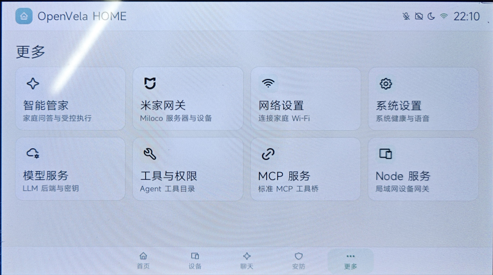
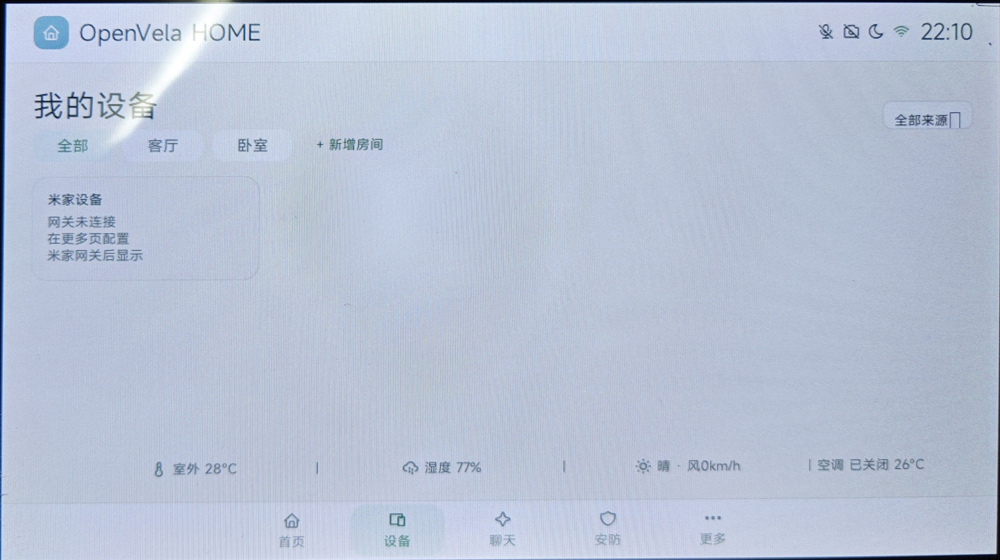
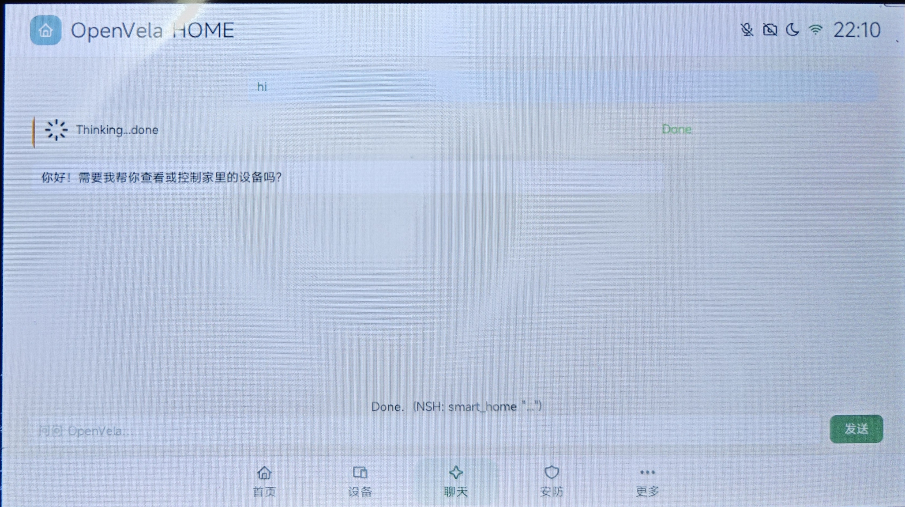

# 2026 首届 openvela AI 硬件开发者大赛 · 作品技术报告

> 队伍：牛蛋先前冲（负责人：唐林杰）｜ 作品：ESP32-P4X 智能家居中控面板 —— openvela 新硬件全栈适配
> 定稿后转 .docx/.pdf，与演示视频（≤5 分钟）、实物照片打包上传；源码与 AI 日志在专属仓 contest2026_031_niudanxianqianchong。
> 正文引用的日志、命令与结论均可在仓内 `competition/` 9 份证据文档中逐字核对。

## 1、信息表

| 项目 | 内容 |
| --- | --- |
| 作品名称 | ESP32-P4X 智能家居中控面板 —— openvela 新硬件全栈适配 |
| 队伍名称 | 牛蛋先前冲 |
| 团队分工 | 个人参赛（负责人：唐林杰）：硬件适配、驱动开发、应用开发与真机验证均由本人完成 |
| 选题方向 | 新硬件平台适配（主）+ AI 硬件产品创新（智能家居应用） |

## 2、摘要

openvela 此前不含 ESP32-P4 支持。本作品以 Route A 方式将其从零适配到
ESP32-P4X-Function-EV-Board，完成芯片/板级/驱动三级移植，8 个外设域真机验收
7 通过：MIPI-DSI 屏（framebuffer+LVGL）、GT911 触摸、SC2336 摄像头 30fps、
板载 C6 WiFi、ES8311 音频、LittleFS 与 7.9MB 字体预加载。并落地智能家居中控：
LVGL UI、米家设备与 Agent 工具控制闭环（LLM 控制摄像机）、DeepSeek 云端对话。
AI 结对开发（代码占比 95%），沉淀 3 个 Skill、9 份证据文档与 2 个 nuttx V4L2 修复。

## 3、正文

### 3.1 绪论

**背景与问题**：智能家居中控需要"屏 + 触摸 + 摄像头 + 音频 + 云端 AI"全栈能力。
ESP32-P4X-Function-EV-Board 硬件规格契合（RISC-V 双核 400MHz、PSRAM、MIPI-DSI/CSI、
板载 C6），但 openvela 分支尚未合入 ESP32-P4——从 0 到 1 完成新芯片接入，并验证
其能承载完整可用的中控应用，是本作品的核心命题。

**技术难点**：

（1）MIPI-DSI/CSI 高速接口在 openvela 树内无先例，需从 ESP-HAL 对接 NuttX framebuffer
与 V4L2，并处理 GDMA 与缓存一致性。

（2）P4 无射频，需打通 P4↔C6 双芯片 SDIO + ESP-Hosted 协议栈，且旧版 C6 固件存在协议缺陷。

（3）Route A 构建体系需自建芯片层 Kconfig/链接脚本与 40 余个 defconfig 矩阵。

**创新点**：

（1）**从 0 到 1 的新平台适配**：芯片层起点的完整移植，非既有板卡调参。

（2）**probe-first 三级证据验收**（枚举成功 ≠ 数据有效 ≠ 时序达标），8 个域全部留下
可复查的真机日志证据链（`competition/`）。

（3）**AI 结对 + Skill 沉淀**：开发方法论沉淀为 3 个可复用 Skill。

### 3.2 系统方案设计

**系统总体架构**：

*图 1　ESP32-P4X 智能家居应用架构（外设层 / 芯片层 / 应用层 / 云端；数据通路 I2C/CSI/I2S/SPI/MIPI-DSI + SDIO/ESP-Hosted + WLAN）*

**关键决策**：选 P4 因其相对 ESP32-S3 的跨度（RISC-V 双核、MIPI DSI/CSI、EMAC、
PSRAM）；Route A（本仓 `chips/ + board/`，manifest 映射）零侵入公共仓、变更收敛在
专属仓，获奖后再上游化；端侧负责 UI/设备控制/媒体通路，云端（cAGENT→TLS→DeepSeek）
负责大模型对话，**断网时 UI 与设备控制不依赖网络**（离线模式可运行）；C6 WiFi 与
板载以太网互为备选通路。

### 3.3 核心算法与技术原理

**云端 AI 工具链**：cAGENT 对话代理经 C6 WiFi → TLS → DeepSeek API 解析自然语言
意图，调用 `miot_device_list` / `miot_device_control` 完成设备查询与**真实控制**
（已验证 LLM→摄像机执行闭环，2026-09-20）。工具集还包括 `run_scene` 场景模式（经
type_name 语义匹配真实设备，如"睡眠"→夜视自动+人形追踪开）与天气/计时等本地工具
（wttr.in 实时数据）。密钥仅存设备侧 secrets 配置、不入库。

**关键机制**：

（1）**probe-first 三级证据分级**：每个外设先独立 probe 验证物理链路，再接入子系统，
避免"点亮即通过"的误判。

（2）**视频帧统一编号**（nuttx patch 0001）：V4L2 完成帧序号连续可审计，300 帧零跳变。

（3）**网络栈缓冲调优**：IOB 池 96→256 缓冲/16→32 链 + esp-hosted RX 配额 8→32，
修复米家 spec 多帧大响应被整帧丢弃。

**openvela 能力落地**：图形（framebuffer + LVGL）、多媒体（V4L2 采集、ES8311
audio lower-half、LittleFS）、AI（cAGENT）三项全部落地；新增 ESP32-P4 芯片层/板级
支持、GT911/EK79007 通用驱动与 ESP-Hosted SDIO 传输层，2 个 V4L2 修复具备上游合入价值。

### 3.4 系统实现

**固件分层**：

| 层 | 目录 | 职责 |
| --- | --- | --- |
| 芯片层 | `chips/esp32p4/` | custom chip、ESP-HAL、MIPI DSI/CSI Host、ESP-Hosted SDIO |
| 板级 | `board/esp32p4/` | bring-up、外设装配、40+ defconfig |
| 通用驱动 | `drivers/nuttx/` | GT911、EK79007 源码 + 2 个 V4L2 patch |
| 验证程序 | `app/` | dsi_probe / gt911_probe / csi_probe / video_test |
| 应用 | `demos/smart_home/` | 中控 UI、米家、摄像头、cAGENT、网络 |

**硬件设计与适配（赛道核心得分项）**：全新平台适配＝**是**。芯片 Espressif
ESP32-P4（RISC-V HP 双核 400MHz + LP 核，768KB SRAM，16MB Flash + PSRAM）；开发板
板载 C6-MINI-1、7 英寸 EK79007 屏、GT911 触摸、SC2336 摄像头、ES8311 音频、RJ45。
实物与 UI 实拍照片见**附录三**。

| 驱动/接口 | 类型 | 真机验收 |
| --- | --- | --- |
| MIPI-DSI + EK79007 | 芯片层 + LCD 驱动 | ✅ 色条 / framebuffer / LVGL |
| GT911 触摸 | input（I2C） | ✅ 单指事件链 + 触摸交互（LVGL 输入） |
| MIPI-CSI + SC2336 | 芯片层 + V4L2 | ✅ 300 帧 30fps + UI 实时预览 |
| ESP-Hosted over SDIO | 网络驱动（双芯片） | ✅ 至 TLS/模型对话闭环 |
| ES8311 音频 | audio lower-half | ✅ codec 初始化 |
| SPI Flash / LittleFS | 存储 | ✅ /data 挂载 + 字体预加载 |
| 内置 EMAC 以太网 | 网络驱动 | 驱动就绪，与 C6 WiFi 互为备选通路（真机验收待补） |
| GPIO / UART / USB Console | 基础外设 | ✅ NSH |

**代表性问题闭环**（完整过程见 `competition/` 对应证据文档）：

（1）*DSI 黑屏*：DBI 命令 LP 传输配置错误——`cmd_mode_cfg` 复位值使命令走 HS 通道，
修复后双路径视觉验收通过。

（2）*C6 SetConfig 超时*：旧版固件对缺失 `threshold`/`pmf_cfg` 嵌套消息不判空崩溃——
按官方主机行为补齐默认消息，配先失败后通过的回归用例。

（3）*CSI 首帧丢失*：扩大 DT 过滤范围 + 完成帧统一编号，300 帧 `sequence_gaps=0`。

（4）*米家七层叠放问题*（单日闭环）：UI 可点击性→spec 重试→抽屉竞态→RX 配额→响应
缓冲→cJSON 堆风暴→UTF-8 截断逐层修复，达成完整控制闭环。

**应用/交互端（UI）**：LVGL 1024×600 横屏中控 UI，light-calm 浅色主题、完整
MiSans 中文字体，底部导航"首页 / 设备 / 聊天 / 安防 / 更多"；无移动端，通过米家云
对接既有生态。各页面实拍见附录三。

（1）**首页**：日期时间与实时天气、回家模式快捷卡片、米家设备/摄像头 G3/Node 设备
等设备卡片与家庭状态汇总。

（2）**更多**：智能管家、米家网关、网络设置、系统设置、模型服务、工具与权限、
MCP 服务、Node 服务等服务入口。

（3）**我的设备**：房间筛选（全部/客厅/卧室）与设备列表，设备卡片支持控制抽屉
（单设备 8 条控件）。

（4）**聊天**：与 Agent 的自然语言对话，展示 Thinking 过程与回复，支持查询与控制
家居设备。

（5）**安防**：安防状态与摄像头实时预览（已真机验收）。

除 UI 页面外，应用侧还提供智能管家与工具体系（已实现，专项验收进行中）：

（6）**智能管家 Skill 体系**：6 类技能（米家控制/场景模式/安全/计时/天气/设备控制）
随数据分区部署，`read_skill` 按需加载并将技能摘要注入模型上下文，新设备类型零代码接入。

（7）**智能家居工具**：`run_scene` 场景模式经 type_name 语义匹配真实设备（如"睡眠"→
夜视自动+人形追踪开）；天气/计时等本地工具经 wttr.in 实时数据。

**自定义 Skill**（`.claude/skills/`，可被 Claude Code / Codex 等 AI 工具直接加载）：

（1）**openvela-board-bringup**：新板/新外设 bring-up 系统流程——源树风格定位、阶段
骨架与"四件套"验收、probe-first 规则、板级 quirks 沉淀（含 ESP32-P4X 实例）。

（2）**openvela-esp32-workflow**：ESP32 构建、烧录与真机验证流程。

（3）**openvela-git-commit**：工作区整理、可审阅提交拆分与中文提交规范。

### 3.5 系统测试与结果分析

**环境**：ESP32-P4X 真机，USB Serial/JTAG 控制台，esptool 烧录；宿主端回归脚本
`scripts/test_hosted_rpc.py`、`test_openvela_http_write.py`。

**功能测试**（原始日志见证据文档）：

| 测试项 | 结果 |
| --- | --- |
| 最小系统 | ✅ 进入 `nsh>`，内建命令可用 |
| 显示 / 触摸 | ✅ 色条→framebuffer→LVGL 首页；单指触摸 + 页面交互 |
| 摄像头 | ✅ `csi_probe raw 10` 内容校验；`video_test 300` 吞吐达标；UI 实时预览 |
| WiFi / 云端对话 | ✅ 关联→DHCP→DNS→TLS 全通，DeepSeek 请求/响应闭环 |
| 米家 | ✅ UI 手动控制 + Agent 工具控制（LLM 真实控制摄像机） |
| 存储 | ✅ `/data` 挂载，完整 MiSans 五档字号创建 |

**性能（实测）**：

| 指标 | 实测值 |
| --- | --- |
| 摄像头吞吐 | 300 帧 **30.02 fps**，`sequence_gaps=0`、`no_buffer=0` |
| 中文字体 | 7,943,504 B 一次性预加载至 PSRAM 用户堆，5 档字号实例 |
| 米家 spec 响应 | 单响应 17,426 B 完整接收（RX 配额 8→32、缓冲 16K→32K） |
| WiFi SDIO | 1-bit 模式、F1 块 512B，枚举与数据面稳定 |

**可靠性**：摄像头 300 帧零序号跳变、零重入错误；触摸长轮询无卡死；TLS 在米家
多轮控制中稳定运行。

### 3.6 AI-Native 开发说明

| 指标 | 数据 |
| --- | --- |
| AI Coding 代码占比 | 95%（AI 结对产出的提交行数占比；人工负责方案决策、真机验证与把关） |
| 使用的 AI 工具 | Codex、Claude Code、DeepSeek harness、ZCode（日志已归档 `logs/`） |
| MCP 工具使用情况 | 未使用外部 MCP 工具 |
| Skills 使用与新增 | 使用官方驱动开发技能集；新增 3 个（见 3.4） |
| Token 使用总量 | 约 89.4 亿（GPT-5.6 约 50 亿、DeepSeek 约 26 亿、GLM-5.3 约 11 亿、MiMo-v2.5-pro 约 2.4 亿） |

AI 深度参与方案设计、驱动实现与真机排障（DSI 黑屏、C6 协议缺陷、CSI 首帧、米家
七层闭环）、应用迭代与文档整理；日志 32 天、80 个会话，按大赛要求归档 `logs/`。

### 3.7 总结与展望

**成果**：完成 openvela 对 ESP32-P4 的从零适配（芯片/板级/驱动/构建体系），8 域
真机验收 7 域通过；智能家居中控从 UI 到云端对话全链路可用；沉淀 3 Skill、9 份证据
文档、2 个 nuttx patch。

**前景与商业价值**：面向需要低成本中控面板的智能家居开发者与厂商——ESP32-P4 成本
低、生态成熟，米家云对接触达既有设备；openvela 轻量实时特性适合无风扇长时运行。
可作为"开发板 + 参考设计"整体输出，或上游化为官方支持板卡降低行业门槛。

**不足与后续**：

（1）弱网/长稳测试与以太网真机验收待补（TLS 链路已闭环）。

（2）GT911 多点触摸（2~5 指）待验收。

（3）计划将 2 个 V4L2 patch 与 GT911/EK79007 驱动 PR 至 nuttx `dev-ai-contest-2026`
分支，获奖后按组委会要求将芯片层/板级适配 PR 至 vendor_espressif。

## 附录一：需提交材料清单（对照模板）

| 序号 | 材料 | 状态 |
| --- | --- | --- |
| 1 | 技术报告（本文档） | 本稿 |
| 2 | 演示视频 ≤5 分钟 | 已录制（`competition/演示/演示视频.mp4`，随提交包上传） |
| 3 | 硬件实物多角度照片 | 已拍摄（`competition/实物图片/`，见附录三） |
| 4 | 海报（入围决赛） | 可后续 |
| 5 | 答辩 PPT（入围决赛） | 可后续 |

打包命名示例：`牛蛋先前冲-ESP32-P4X智能家居中控面板-contest2026_031_niudanxianqianchong.zip`。

## 附录二：评审维度对照

| 评审维度（分值） | 本报告对应章节 |
| --- | --- |
| 技术难度（30） | 3.2 / 3.3 / 3.4（硬件适配为核心得分项）/ 3.5 |
| 产品创新性（20） | 2 摘要；3.1 创新点 |
| 项目完整度（20） | 3.5；专属仓源码（9 份证据文档）；实物照片 |
| AI 开发（10） | 3.3 AI 算法实现；3.6 AI-Native |
| 商业潜力（10） | 3.7 前景与商业价值 |
| 展示效果（10） | 演示视频；照片；海报；答辩 PPT |

## 附录三：作品实物与 UI 实拍

*图 2　整机正面实拍（屏幕运行 OpenVela HOME 中控首页）*

*图 3　整机背面与接口（Function_EV_Board V1.6，摄像头排线、触摸/显示 FPC、USB 接口）*

|  |  |
| --- | --- |
|  |  |
|  |  |

*图 4　中控 UI 实拍（首页 / 更多 / 我的设备 / 聊天）*
