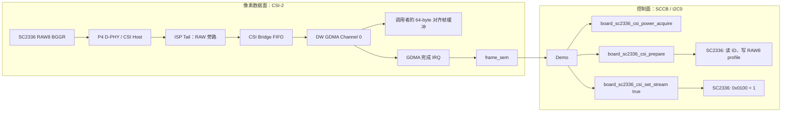
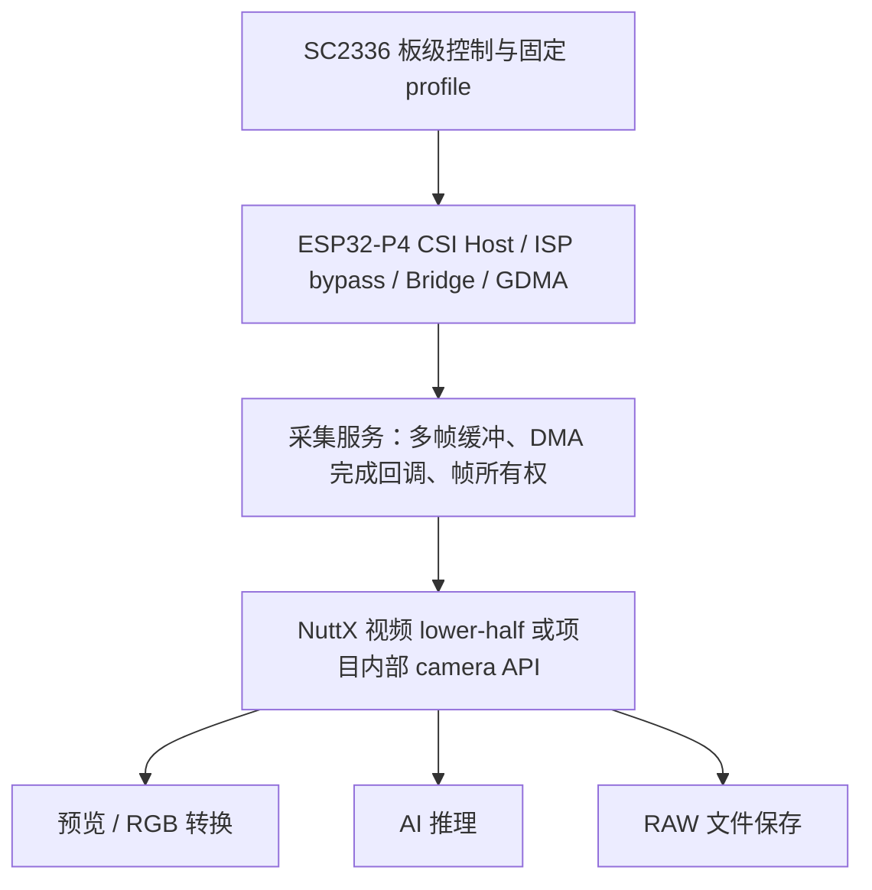

# ESP32-P4X SC2336 摄像头 Demo 接入指南

> 适用对象：ESP32-P4X Function EV Board、SC2336 模组、OpenVela/NuttX
> 当前能力：SC2336 RAW8 单缓冲采集到内存，已完成真机单帧和十帧验证

## 1. 先明确可用能力

当前驱动提供的是面向 Demo 和底层算法验证的 **CSI RAW 接收原语**。应用能够配置
板载 SC2336、等待 DMA 收到 RAW8 帧，并在内存中读取该帧。

| 已具备 | 当前不具备 |
| --- | --- |
| SCCB 探测和固定 SC2336 RAW8 profile 配置 | `/dev/video0`、V4L2 或通用摄像头 `open/read/ioctl` 接口 |
| 1024 × 600、RAW8、BGGR、2 lane、DT `0x2a` 接收 | YUV/RGB 输出、Bayer 去马赛克、自动白平衡和缩放 |
| CSI Host → ISP RAW 旁路 → Bridge → GDMA → RAM | 多缓冲帧队列和生产级帧消费者并发模型 |
| 帧完成等待、错误统计、缓存同步 | 图像预览、LCD 显示和文件导出命令 |

所以 Demo 不应尝试打开 `/dev/video0`。应直接调用本指南中的板级接口和
`esp_mipi_csi_*()` 接口；应用取得的是 **614400 byte 的 RAW8/BGGR 像素阵列**。

当前固定 profile：

| 参数 | 值 |
| --- | --- |
| SCCB | I2C0、地址 `0x30`、100 kHz |
| 图像 | RAW8 BGGR，1024 × 600，30 fps |
| CSI-2 | 2 data lane，DT `0x2a` |
| 帧大小 | `1024 * 600 * 1 = 614400` byte |
| 传感器串行速率 | 288 Mbps/lane |
| P4 Host PHY 速率选择 | 200 Mbps/lane |
| D-PHY LDO | channel 3，2500 mV |

传感器模式表的 288 Mbps/lane 和 P4 接收端的 200 Mbps/lane 是两个不同层的
参数。后者是已在该板验证通过的 P4 Host PHY 校准选择，Demo 不应自行改写。

## 2. 启用方式

### 2.1 以 `csi_probe` 验证底座

仓库已有独立配置：

```bash
./build.sh \
  contest2026_031_niudanxianqianchong/board/esp32p4/esp32p4-function-ev-board/configs/csi_probe \
  -j2
```

烧录后先在 NSH 执行：

```text
nsh> csi_probe sensor
nsh> csi_probe raw
nsh> csi_probe raw 10
```

`raw` 成功的最低判据是：

```text
frame: bytes=614400 ... nonzero=yes nonconstant=yes
stats: frames=1 dma=0 bridge(overrun=0 fifo=0 discard=0 size=0)
stats: csi(ecc=0 crc=0 phy=0 packet=0)
csi_probe: PASS raw frames=1 ...
```

如果这个基线未通过，不应先把摄像头接入上层 Demo。使用 `csi_probe rawdiag`
收集接收路径的 ISP、Bridge 和 GDMA 分界状态，具体定位方法见
[`CSI RAW 接收故障修复记录`](../开发日志/ESP32-P4X-SC2336-CSI-RAW接收故障修复.md)。

### 2.2 在自己的 Demo 中选择依赖

Demo 的 Kconfig 至少应选择下面的能力。现有
`app/csi_probe/Kconfig` 是可直接参考的实现。

```kconfig
config LVX_USE_DEMO_MY_CAMERA
    bool "My SC2336 RAW demo"
    depends on ARCH_BOARD_ESP32P4_FUNCTION_EV_BOARD
    select ESPRESSIF_I2C0
    select I2C_RESET
    select ESPRESSIF_MIPI_CSI
    select ESPRESSIF_SPIRAM
    select ESPRESSIF_SPIRAM_USER_HEAP
    select ESP32P4_FUNCTION_EV_BOARD_CAMERA
    select ESP32P4_FUNCTION_EV_BOARD_CAMERA_SC2336
```

`ESPRESSIF_SPIRAM_USER_HEAP` 用于保证有足够的可分配内存容纳 614400-byte
帧缓冲。若 Demo 有自己的 Kconfig 名称，只需替换第一行配置名，保留这些依赖。

使用 CMake 的 Demo 可沿用以下最小注册方式：

```cmake
if(CONFIG_LVX_USE_DEMO_MY_CAMERA)
  nuttx_add_application(
    NAME my_camera
    SRCS my_camera_main.c
    STACKSIZE 4096)
endif()
```

应用源码需要包含：

```c
#include <arch/board/board.h>
#include <arch/chip/esp_mipi_csi.h>
```

`board.h` 中的 SC2336 接口只在
`CONFIG_ESP32P4_FUNCTION_EV_BOARD_CAMERA_SC2336=y` 时声明。当前接口属于
Function EV Board；移植到其他 P4 板时，应实现该板的传感器 profile、SCCB、
MCLK、RESET/PWDN 与 D-PHY LDO 配置，不能复用这里的板级常量。

## 3. 数据流和调用链

摄像头有两条关联但独立的链路：SCCB 控制面负责配置传感器；CSI-2 数据面负责
把像素写入 RAM。SCCB 读到产品 ID 不代表已经收到图像。



应用侧的正常调用链为：

```text
Demo
  -> board_sc2336_csi_power_acquire()
       -> 生成固定 RAW8 profile
       -> esp_mipi_csi_power_acquire()：申请 D-PHY LDO
  -> board_sc2336_csi_prepare()
       -> I2C0 初始化、SC2336 ID 校验、写 RAW8 模式表
  -> 分配并清零 64-byte 对齐帧缓冲
  -> board_sc2336_csi_set_stream(true)
       -> 写 SC2336 0x0100 = 0x01
  -> board_sc2336_csi_initialize()
       -> 配置 P4 CSI Host、ISP RAW 旁路、Bridge、GDMA 资源
  -> esp_mipi_csi_start()
       -> Cache Clean、配置 LLI 和 IRQ、启动 GDMA、使能 Bridge
  -> esp_mipi_csi_wait_frame()
       -> 等待 GDMA 完成 ISR 的 frame_sem
  -> esp_mipi_csi_stop()
  -> esp_mipi_csi_buffer_sync_for_cpu()
  -> Demo 消费 RAW 帧
  -> 反向释放 CSI、传感器、SCCB、D-PHY LDO 和缓冲区
```

必须先停止 CSI，再执行 CPU 缓存同步和读取缓冲区。当前单缓冲实现会在每个完成
中断中重装同一个 LLI；采集中直接读取缓冲区会与下一帧 DMA 写入竞争。

## 4. 驱动接口和使用顺序

### 4.1 板级 SC2336 接口

| 函数 | 作用 | 调用要求 |
| --- | --- | --- |
| `board_sc2336_csi_power_acquire(&config, &csi)` | 获取固定 profile、申请 D-PHY LDO、返回 CSI 句柄 | 首个调用；成功后必须最终释放。 |
| `board_sc2336_csi_prepare(&product_id)` | 初始化 SCCB、校验 ID、写 RAW8 profile，保持 stream off | 必须在 LDO 获取后调用。 |
| `board_sc2336_csi_set_stream(true)` | 让 SC2336 开始输出 CSI-2 数据 | profile 配置后调用。 |
| `board_sc2336_csi_initialize(csi, &config)` | 初始化 CSI Host、ISP RAW 旁路、Bridge 和 DMA | stream on 后、启动 DMA 前调用。 |
| `board_sc2336_csi_deinitialize(csi)` | 释放 CSI Host、Bridge、DMA 等接收端资源 | 停止采集后调用。 |
| `board_sc2336_csi_set_stream(false)` | 停止 SC2336 输出 | CSI 接收端反初始化后调用。 |
| `board_sc2336_csi_release()` | 释放板级持有的 SCCB/I2C0 会话 | stream off 后调用。 |
| `board_sc2336_csi_power_release(csi)` | 释放 D-PHY LDO | 最后调用。 |

板级代码持有一个摄像头 SCCB 会话，`prepare()` 到 `release()` 期间不要在另一个
任务中直接访问同一传感器或重复调用 `prepare()`；后者会返回 `-EBUSY`。

### 4.2 接收端接口

| 函数 | 作用 | 关键约束 |
| --- | --- | --- |
| `esp_mipi_csi_start(csi, buffer, bytes)` | 启动连续 DMA 接收 | `bytes` 必须等于 profile 的一帧长度，当前为 614400。缓冲区由调用者持有。 |
| `esp_mipi_csi_wait_frame(csi, timeout_ms)` | 等待一帧 DMA 完成 | `timeout_ms` 必须非零；成功表示收到一个完成事件。 |
| `esp_mipi_csi_wait_frame_diag(csi, timeout_ms)` | 带硬件状态日志地等待一帧 | 仅用于 bring-up 排障，不应在正式帧循环中调用。 |
| `esp_mipi_csi_stop(csi)` | 停止 Bridge 和 DMA | 成功后缓冲区不再由当前采集写入。 |
| `esp_mipi_csi_buffer_sync_for_cpu(buffer, bytes)` | 让 CPU 看见 DMA 写入的内容 | 必须在 `stop()` 后；地址和长度均须 64-byte 对齐。 |
| `esp_mipi_csi_get_stats(csi, &stats)` | 取得完成帧与错误计数快照 | 可在超时、停止后或验收时调用。 |

`esp_mipi_csi_start()` 的单缓冲语义是连续接收时重复使用同一个 `buffer`。如果
Demo 等待 10 次完成事件，缓冲区只保留停止时的最后一帧，不会保留十帧历史。

## 5. 最小 Demo 示例

下面的函数展示一帧 RAW8 的完整生命周期。`consume_raw8_bggr()` 代表 Demo 的
算法、文件写入或统计逻辑；它只能在缓存同步成功后访问 `buffer`。

```c
#include <nuttx/config.h>

#include <arch/board/board.h>
#include <arch/chip/esp_mipi_csi.h>

#include <errno.h>
#include <stdbool.h>
#include <stdint.h>
#include <stdlib.h>
#include <string.h>

#define CAMERA_FRAME_TIMEOUT_MS  1000
#define CAMERA_BUFFER_ALIGNMENT    64

static void consume_raw8_bggr(const uint8_t *buffer, size_t bytes)
{
  /* Consume exactly 1024 x 600 RAW8/BGGR pixels here. */
}

static int camera_capture_one(void)
{
  struct esp_mipi_csi_config_s config;
  struct esp_mipi_csi_s *csi = NULL;
  uint8_t *buffer = NULL;
  size_t frame_bytes;
  uint16_t product_id;
  bool power_on = false;
  bool sensor_on = false;
  bool csi_ready = false;
  bool csi_running = false;
  int cleanup_ret;
  int ret;

  ret = board_sc2336_csi_power_acquire(&config, &csi);
  if (ret < 0)
    {
      goto out;
    }

  power_on = true;
  ret = board_sc2336_csi_prepare(&product_id);
  if (ret < 0)
    {
      goto out;
    }

  frame_bytes = (size_t)config.width * config.height *
                config.bits_per_pixel / 8;
  buffer = memalign(CAMERA_BUFFER_ALIGNMENT, frame_bytes);
  if (buffer == NULL)
    {
      ret = -ENOMEM;
      goto out;
    }

  memset(buffer, 0, frame_bytes);
  ret = board_sc2336_csi_set_stream(true);
  if (ret < 0)
    {
      goto out;
    }

  sensor_on = true;
  ret = board_sc2336_csi_initialize(csi, &config);
  if (ret < 0)
    {
      goto out;
    }

  csi_ready = true;
  ret = esp_mipi_csi_start(csi, buffer, frame_bytes);
  if (ret < 0)
    {
      goto out;
    }

  csi_running = true;
  ret = esp_mipi_csi_wait_frame(csi, CAMERA_FRAME_TIMEOUT_MS);
  if (ret < 0)
    {
      goto out;
    }

  ret = esp_mipi_csi_stop(csi);
  csi_running = false;
  if (ret < 0)
    {
      goto out;
    }

  ret = esp_mipi_csi_buffer_sync_for_cpu(buffer, frame_bytes);
  if (ret < 0)
    {
      goto out;
    }

  consume_raw8_bggr(buffer, frame_bytes);

out:
  if (csi_running)
    {
      cleanup_ret = esp_mipi_csi_stop(csi);
      if (ret >= 0 && cleanup_ret < 0)
        {
          ret = cleanup_ret;
        }
    }

  if (csi_ready)
    {
      cleanup_ret = board_sc2336_csi_deinitialize(csi);
      if (ret >= 0 && cleanup_ret < 0)
        {
          ret = cleanup_ret;
        }
    }

  if (sensor_on)
    {
      cleanup_ret = board_sc2336_csi_set_stream(false);
      if (ret >= 0 && cleanup_ret < 0)
        {
          ret = cleanup_ret;
        }
    }

  cleanup_ret = board_sc2336_csi_release();
  if (ret >= 0 && cleanup_ret < 0)
    {
      ret = cleanup_ret;
    }

  if (power_on)
    {
      cleanup_ret = board_sc2336_csi_power_release(csi);
      if (ret >= 0 && cleanup_ret < 0)
        {
          ret = cleanup_ret;
        }
    }

  free(buffer);
  return ret;
}
```

上例与 `csi_probe raw` 使用相同的资源顺序。实际 Demo 可以把帧长度断言为
614400，也应检查 `config.width`、`config.height`、`config.data_type` 和
`config.bits_per_pixel`，防止在 profile 变化后仍按旧格式解析。

## 6. 连续采集、图像使用和错误处理

### 6.1 现阶段如何采集多帧

若 Demo 只需要确认连续性，可以在一次 `start()` 后多次调用
`esp_mipi_csi_wait_frame()`，再执行 `stop()` 和缓存同步：

```c
for (frame = 0; frame < requested_frames; frame++)
  {
    ret = esp_mipi_csi_wait_frame(csi, 1000);
    if (ret < 0)
      {
        break;
      }
  }

/* 成功后：stop() -> buffer_sync_for_cpu() -> 使用最后一帧。 */
```

不要在每次 `wait_frame()` 后立即处理同一个缓冲区，因为中断会将 DMA 重新 arm
到它。需要逐帧运行算法时，应先扩展为多缓冲队列和帧所有权交接；这属于后续
视频 lower-half 或专用采集服务的职责。

### 6.2 RAW8/BGGR 的最小解释

帧内没有行首、行尾或像素格式头。像素 `(x, y)` 的地址为：

```text
offset = y * 1024 + x
pixel  = buffer[offset]
```

BGGR Bayer 的 2 × 2 重复单元为：

```text
B G B G ...   y = 偶数
G R G R ...   y = 奇数
```

直接显示需要 Bayer 去马赛克后转换为 RGB；灰度算法可直接使用每个 RAW8 字节，
但应接受 Bayer 采样导致的相邻像素颜色差异。

### 6.3 每次采集后的统计检查

在 `stop()` 后调用 `esp_mipi_csi_get_stats()`。正常采集应满足：

```text
frame_count >= 请求帧数
dma_error_count == 0
bridge_overrun_count == 0
bridge_fifo_overflow_count == 0
bridge_discard_count == 0
bridge_frame_size_error_count == 0
csi_ecc_error_count == 0
csi_crc_error_count == 0
csi_phy_error_count == 0
csi_packet_error_count == 0
```

常见返回值和处理方向：

| 返回值/现象 | 优先检查 |
| --- | --- |
| `-ETIMEDOUT`，来自 `wait_frame()` | 先运行 `csi_probe rawdiag`；检查传感器 stream、MCLK、供电、CSI 时钟和 Lane。 |
| `-EINVAL`，来自 `start()` | 帧缓冲地址、长度或 profile 参数不符合 DMA 接收要求。 |
| `-EINVAL`，来自 `buffer_sync_for_cpu()` | 地址或长度没有按 64 byte cache line 对齐。 |
| `-EPIPE` | 调用顺序错误，或 CSI/SCCB session 已经释放。 |
| 非零 CSI/Bridge/DMA 计数 | 停止当前采集并保存统计；不要把该帧交给上层算法。 |

## 7. 从 Demo 走向正式摄像头服务

当前原语适合单任务 bring-up、RAW 文件导出和一次性 AI 推理验证。要让多个应用
稳定使用摄像头，建议建立如下层次：



采集服务至少需要：两个或更多 64-byte 对齐缓冲、空闲/采集中/就绪三种帧状态、
消费者完成后的归还机制，以及 CSI/Bridge 独立错误处理。完成这些后，才适合
注册 `/dev/video0` 或提供稳定的应用级帧队列。

## 8. 源码入口

| 位置 | 用途 |
| --- | --- |
| `app/csi_probe/csi_probe_main.c` | 可运行的单缓冲 Demo 参考实现。 |
| `app/csi_probe/Kconfig` | Demo 所需 Kconfig 依赖。 |
| `board/esp32p4/esp32p4-function-ev-board/include/board.h` | SC2336 板级公开函数声明。 |
| `board/esp32p4/esp32p4-function-ev-board/src/esp32p4_camera.c` | LDO、SCCB、profile 和 stream 生命周期。 |
| `chips/esp32p4/include/esp_mipi_csi.h` | CSI 接收端公开接口、配置与统计结构。 |
| `chips/esp32p4/common/espressif/esp_mipi_csi.c` | CSI Host、ISP 旁路、Bridge、GDMA 和 cache 实现。 |
| `docs/开发日志/ESP32-P4X-SC2336-CSI-RAW接收故障修复.md` | 已解决故障、根因和真机证据。 |
