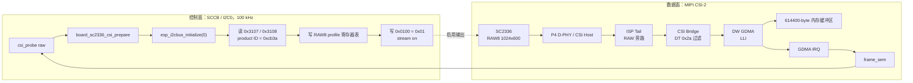
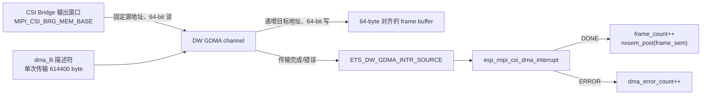

# ESP32-P4X SC2336：SCCB、MIPI-CSI 与 GDMA 数据流和调用链

> 记录日期：2026-09-08
> 范围：`csi_probe raw` 诊断路径。本文保留首帧超时阶段的调用关系和定位方法，
> 不把 RAW 采集、ISP、显示和正式视频设备混为同一项能力。

## 1. 目标与当前边界

当前路径的目标是从 SC2336 接收一帧 RAW8 数据到内存，验收条件为：

- 分辨率为 1024 × 600，帧长为 `1024 * 600 * 1 = 614400` byte。
- DMA 完成计数达到请求帧数。
- 缓冲区不是全零，也不是固定字节值。
- CSI Host、Bridge 和 GDMA 的错误计数为零。

它是底层 bring-up 诊断，不注册 `/dev/video0`，不包含 Bayer 解码、ISP、
RGB/YUV 转换、帧队列或 LCD/LVGL 显示。

当前真机已通过单帧 `csi_probe raw` 和连续 `csi_probe raw 10`：DMA 帧数达到
请求值，帧缓冲非全零、非恒定，CSI、Bridge 和 DMA 错误计数均为零。本文第 7 节
的 `-ETIMEDOUT` 是修复前的历史快照；最终根因、修改和日志见
[`CSI RAW 接收故障修复记录`](ESP32-P4X-SC2336-CSI-RAW接收故障修复.md)。

## 2. 两条独立但关联的链路

SC2336 的控制与视频数据走不同物理链路。SCCB 成功只证明传感器能够响应
寄存器访问，不能证明 MIPI 视频数据已经输出。



当前 profile 的约束如下：

| 项目 | 当前值 |
| --- | --- |
| SCCB 从地址 | `0x30` |
| I2C 总线 / 频率 | I2C0 / 100 kHz |
| 产品 ID | `0xcb3a` |
| CSI-2 data type | `0x2a`，RAW8 |
| 数据 lane | 2 |
| 传感器串行 lane 速率 | 288 Mbps/lane（SC2336 模式表） |
| P4 CSI Host PHY 速率选择 | 200 Mbps/lane（已通过 ESP-IDF P4X 基线） |
| XCLK / RESET / PWDN | 24 MHz 由模组或板级固定电路提供；P4 GPIO 均不控制 |
| 图像尺寸 | 1024 × 600 |
| 单帧字节数 | 614400 |
| D-PHY LDO | channel 3，2500 mV |

## 3. 从 NSH 命令到首帧的调用链

`csi_probe raw` 的正常路径按下面顺序执行：

```text
csi_probe_raw()
  ├─ board_sc2336_csi_power_acquire()
  │    ├─ board_sc2336_csi_get_profile()
  │    └─ esp_mipi_csi_power_acquire()
  │         └─ esp_ldo_acquire(channel=3, 2500mV)
  ├─ board_sc2336_csi_prepare()
  │    ├─ esp_i2cbus_initialize(I2C0)
  │    ├─ esp32p4_sc2336_probe()
  │    │    └─ I2C_TRANSFER(): 读 0x3107、0x3108
  │    └─ esp32p4_sc2336_configure_raw8()
  │         └─ I2C_TRANSFER(): 写 SC2336 RAW8 寄存器表
  ├─ memalign(64, 614400)
  ├─ board_sc2336_csi_set_stream(true)
  │    └─ esp32p4_sc2336_set_stream(): 写 0x0100 = 0x01
  ├─ board_sc2336_csi_initialize()
  │    └─ esp_mipi_csi_initialize()
  ├─ esp_mipi_csi_start(buffer, 614400)
  ├─ esp_mipi_csi_wait_frame(csi, 1000)
  ├─ esp_mipi_csi_stop()
  ├─ esp_mipi_csi_buffer_sync_for_cpu()
  ├─ 检查帧内容、CRC32 与 esp_mipi_csi_get_stats()
  └─ 释放 CSI、SCCB 与 LDO
```

出错时应用跳转到统一清理路径：先停止 CSI 和释放 DMA，再反初始化 CSI，
停止传感器 stream，释放 I2C，最后释放 D-PHY LDO。这样传感器不会继续向已
释放的 DMA 接收端送数据。

## 4. CSI Host 与 Bridge 初始化

`esp_mipi_csi_initialize()` 负责把 profile 变成 P4 接收端配置，日志中的阶段
与动作对应如下：

| 日志阶段 | 主要动作 | 意义 |
| --- | --- | --- |
| `phy_clock_enable` | 使能 D-PHY 时钟源 | 接收 PHY 的时钟前提 |
| `host_bridge_clock_reset` | 打开并复位 CSI Host、Bridge 与 PHY 配置时钟 | 消除上次运行留下的状态 |
| `hal_initialize` | 调用 Espressif MIPI CSI HAL | 写入 lane 数、尺寸、bpp、lane 速率 |
| `bridge_configure` | 设置宽高、DT 范围、burst 和 FIFO 阈值 | Bridge 只接收 RAW8 DT=`0x2a` 数据 |
| `complete` | 初始化信号量和期望帧长 | 允许后续启动 DMA |

此处的 `complete` 仅代表寄存器和 HAL 配置已执行成功；它不代表传感器已经
进入高速传输，也不代表 Host 收到有效 CSI-2 包。

## 5. DMA 配置、数据移动与完成通知

`esp_mipi_csi_start()` 先把调用者提供的帧缓冲做 Cache Clean，再调用
`esp_mipi_csi_prepare_dma()`。DMA 的核心关系如下：



实现要点：

- 单帧缓冲由 `memalign(64, 614400)` 分配；启动前以
  `ESP_CACHE_MSYNC_FLAG_DIR_C2M` 交给 DMA。
- LLI 描述符的源为 CSI Bridge memory window，目标为该帧缓冲；描述符本身也
  在启动前做 Cache Clean。
- 首次采集在 LLI 与 IRQ 准备完成后，先设置运行状态、使能 GDMA 通道并回读
  `CHEN`，再使能 Bridge；日志阶段为 `dma_channel_enable`。旧实现只在完成
  ISR 中重新使能通道，遗漏首次使能，导致首帧无法启动。此次修复待真机验证。
- 收到 DMA DONE 后，中断处理函数读取 Host 和 Bridge 状态，增加统计计数，
  再重新有效化终止 LLI 并重新使能 DMA 通道，以支持下一帧。
- `esp_mipi_csi_wait_frame()` 等待 `frame_sem`。中断没有 post 信号量时，
  1000 ms 后返回 `-ETIMEDOUT`。
- 结束采集后，应用以 `ESP_CACHE_MSYNC_FLAG_DIR_M2C` 使 CPU 可看到 DMA
  写入后的内存，再计算 CRC32 和数据分布。

目前只有一个调用者缓冲和一个 DMA LLI，连续 `raw 10` 的语义是“累计收到
10 次完成事件，缓冲中保留最近一次写入的帧”，不是多帧队列。

## 6. 中断与错误统计

正常设计中，GDMA 完成中断负责帧完成，CSI Bridge 中断负责 Bridge 错误。
当前 P4 路径存在一个独立问题：动态 IRQ 分配的第二次申请在真机上不能返回，
且交换“先 Bridge 后 GDMA”与“先 GDMA 后 Bridge”的顺序后仍复现。

因此现阶段采用以下临时诊断方式：

- 只注册 GDMA IRQ；已观察到 `dma_irq_setup result=0 cpuint=4`。
- Bridge CPU 中断保持关闭。
- 在 DMA 完成、帧超时和读取统计时，读取 Bridge 的粘滞 `int_raw`，清除后
  计入统计。
- 帧超时时同时采样 CSI Host `int_st_main`，并由 `csi_probe` 在资源清理前
  输出两行 `stats:`。

首帧超时还会输出 Host、PHY、Bridge 与 GDMA 的单次接收快照：

```text
stats: host(main=... phy_fatal=... packet_fatal=... phy=...)
stats: phy(rx=... stopstate=...) bridge(raw=... enable=... buffer=...)
stats: dma(channel=... transferred_64bit=... fifo_64bit=... source=...)
```

Bridge 的 `raw` 是粘滞原始状态，bit 5 表示 DMA 配置已更新；`buffer` 含 FIFO
深度。Host 没有 `int_raw`，其事件寄存器读取后会清除，因此采样只放在超时边界。
`phy.rx` bit 17 为时钟 lane HS 活动，`phy.stopstate` 的 bit 0、1、16 分别对应
data lane 0、data lane 1 和 clock lane 的 Stop 状态。GDMA 的
`transferred_64bit` 为已传输的 64-bit 单元；完整 614400-byte RAW8 帧为 76800。

统计字段的含义：

| 字段 | 解释 | 典型下一步 |
| --- | --- | --- |
| `frames` | DMA 完成帧数 | 为零表示没有完成 DMA 传输 |
| `dma` / `last_dma_status` | GDMA 错误和最近状态 | 检查 LLI、DMA channel 与内存可达性 |
| `bridge(overrun/fifo/discard/size)` | Bridge FIFO、丢弃、帧大小错误 | 检查 Host 输出、Bridge 尺寸、DT 和 DMA 吞吐 |
| `csi(ecc/crc/phy/packet)` | Host 的 CSI-2 协议或 PHY 错误 | 分别核对信号质量、lane、速率、DT 与寄存器表 |
| `last_host_status` / `last_bridge_status` | 最近一次采样的原始状态 | 与对应计数一起判断错误来源 |

Bridge 轮询的错误发现可能晚于硬件中断；它只能服务当前单帧 bring-up，不是
正式连续采集的最终中断架构。

## 7. 历史 `-ETIMEDOUT` 的含义

已经出现的日志顺序为：

```text
SC2336 stream on
MIPI-CSI initialize: stage=complete frame_bytes=614400
MIPI-CSI start: stage=complete result=0
csi_probe: FAIL step=wait_frame frame=1 ret=-110
SC2336 stream off
```

这能排除“初始化函数立即失败”“DMA IRQ 第一路申请失败”和“应用未使能
Bridge”等软件控制面问题。它还不能确定故障在传感器、物理链路还是接收端，
因为没有 DMA DONE。

本轮 `csi_probe raw` 已打印以下超时快照：

```text
stats: frames=0 dma=0 bridge(overrun=0 fifo=0 discard=0 size=0)
stats: csi(ecc=0 crc=0 phy=0 packet=0) last(dma=0x00000000 bridge=0x00000000 host=0x00000000)
```

它表示 P4 接收链路没有得到 DMA DONE，也没有观测到已采样的 CSI/Bridge 错误。
已核对本机可出图的 ESP-IDF P4X SC2336 基线：它将 `xclk_pin`、`reset_pin` 和
`pwdn_pin` 均设为 `-1`，但使用同一个 `MIPI_2lane_24Minput_RAW8_1024x600_30fps`
模式成功出图。因此本板没有需要补齐的 P4 GPIO 上电、时钟或复位序列；24 MHz
XCLK、复位和传感器电源由模组或板级固定电路处理。软件源本身不能再区分两者。
通用传感器库中的 PWDN 高 10 ms 再低
10 ms、RESET 低 10 ms 再高 10 ms，只适用于这些引脚实际连至 SoC 的板型，不能
移植到本板。

该基线的传感器模式表声明 288 Mbps/lane，但其 CSI Host 配置为 200 Mbps/lane。
后者由 HAL 用于选择 D-PHY HS 频率档。OpenVela 已保持 288 作为传感器模式值，
并以 200 配置 Host；下一次 `csi_probe raw` 的首帧统计将验证这一接收端对齐是否
使数据进入 DMA。

接下来的判断顺序是：

- Host/Bridge 错误非零：按统计字段继续收敛到 PHY、CSI 包格式或 Bridge/DMA。
- 所有错误均为零且 `frames=0`：先以已通过 ESP-IDF 基线的 Host PHY 速率
  200 Mbps/lane 验证接收端。若仍无帧，再测量模组提供的 24 MHz XCLK、时钟 lane、
  两条数据 lane 及实际 stream 输出；不新增未经原理图证实的 P4 GPIO 控制。
- `frames>0` 而帧校验失败：再检查 DMA Cache、buffer、RAW 数据分布和 profile。

## 8. 源码入口

| 层级 | 文件 | 主要职责 |
| --- | --- | --- |
| 诊断应用 | `app/csi_probe/csi_probe_main.c` | NSH 命令、缓冲分配、超时、帧校验和资源回收 |
| 板级装配 | `board/esp32p4/esp32p4-function-ev-board/src/esp32p4_camera.c` | profile、LDO 生命周期、I2C0 与 CSI 接口桥接 |
| SC2336 控制 | `board/esp32p4/esp32p4-function-ev-board/src/esp32p4_sc2336.c` | SCCB 读写、ID、profile 寄存器表、stream 控制 |
| CSI 芯片驱动 | `chips/esp32p4/common/espressif/esp_mipi_csi.c` | D-PHY、Host/Bridge、GDMA、IRQ、Cache 和统计 |
| CSI 公共接口 | `chips/esp32p4/include/esp_mipi_csi.h` | 配置、状态统计和生命周期接口 |

关联的真机验证与适配结论见
[SC2336 摄像头适配](../硬件适配/ESP32-P4X-SC2336摄像头适配.md)。
