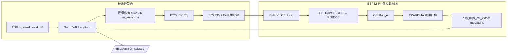
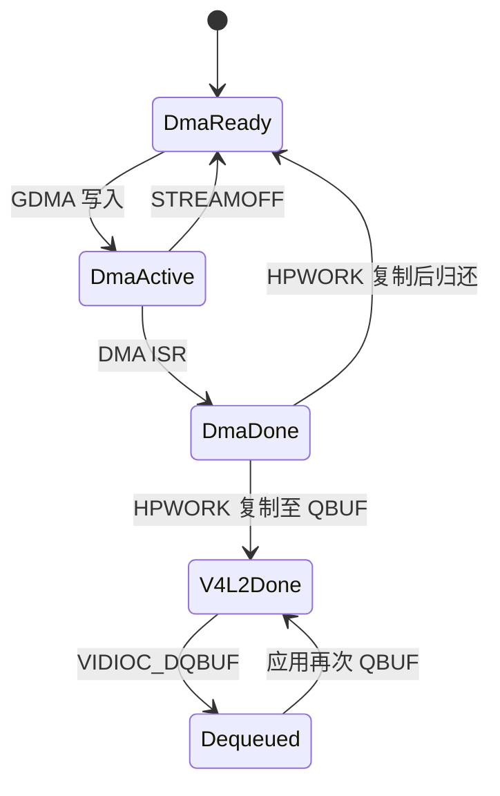

# ESP32-P4X SC2336 `/dev/video0` 实施方案

> 状态：待实现。本文是代码改造与验收计划，不表示 `/dev/video0`、ISP 或 RGB565
> 已可用。
>
> 适用硬件：ESP32-P4 Function EV Board、SC2336 摄像头模组。
>
> 固定首期输出：1024 × 600、30 fps、`V4L2_PIX_FMT_RGB565`。

## 1. 目标与边界

本阶段将已验证的 SC2336 RAW8 CSI 接收链路接入 NuttX V4L2 capture
upper-half，在板级注册 `/dev/video0`。传感器仍输出 RAW8/BGGR；ESP32-P4
ISP 完成去马赛克后，DMA 向 V4L2 交付 RGB565 帧。

本方案作出以下确定选择：

1. 在 ESP32-P4 芯片层新增 NuttX 原生 ISP 适配层。
2. `/dev/video0` 固定协商 `V4L2_PIX_FMT_RGB565`，不修改
   `nuttx/drivers/video/v4l2_cap.c`、`imgdata.h` 或 `imgsensor.h`。
3. SC2336 保持 P4X 板级私有驱动，继续以
   `board/esp32p4/esp32p4-function-ev-board/src/esp32p4_sc2336.c` 为实现位置；
   不新增 NuttX 通用 `sc2336.c`。
4. 数据面实现 V4L2 缓冲队列，最少支持双缓冲，默认申请三块 PSRAM 帧缓冲。
5. `csi_probe` 保留 RAW bypass 诊断用途；`video` defconfig 不与其同时启用，
   防止两个端点竞争唯一的 CSI Host、ISP、Bridge、GDMA 与 SC2336 会话。

当前已验证的 RAW 基线是 1024 × 600、RAW8 BGGR、2 Lane、DT `0x2a`，
SC2336 传感器模式串行速率为 288 Mbps/lane，P4 CSI Host 使用已验证的
200 Mbps/lane PHY 校准值。该基线是 ISP 视频方案的输入前提，不在本阶段调整。

## 2. 目标数据流



`/dev/video0` 是采集端点，不直接写入 `/dev/fb0`。预览应用必须在
`DQBUF` 取得独立的 RGB565 帧后，再按 framebuffer 的格式和更新规则显示，
不能让摄像头 DMA 覆盖 LCD 扫描缓冲。

## 3. 为什么不修改 v4l2_cap.c

NuttX 当前 capture upper-half 已支持 `V4L2_PIX_FMT_RGB565`：

- 能将 V4L2 RGB565 转换为 `imgsensor_s` 与 `imgdata_s` 的内部 RGB565 格式；
- 接受 RGB565 的格式协商；
- 按 `width × height × 2` 计算帧缓冲长度。

因此，首期使用 RGB565 可以避开 RAW Bayer 格式贯通所需的通用修改。尤其不应把
RAW8 数据伪装成 RGB565；实际 DMA 内容必须是 ISP 已处理的 RGB565。

这也意味着本期不修改以下文件：

```text
nuttx/drivers/video/v4l2_cap.c
nuttx/include/nuttx/video/imgdata.h
nuttx/include/nuttx/video/imgsensor.h
```

若将来需要发布 RAW Bayer `/dev/video0`，再单独为
`V4L2_PIX_FMT_SBGGR8` 扩展上面三个通用文件，不能混入本期 RGB565 工作。

## 4. 必须修改和新增的文件

### 4.1 ESP32-P4 芯片层

| 文件 | 动作 | 实现内容 |
| --- | --- | --- |
| `chips/esp32p4/common/espressif/esp_mipi_csi.c` | 修改 | 保留已验证的 D-PHY、CSI Host 和 GDMA 基础；增加 ISP 输出模式；由 RAW bypass 配置改为根据模式配置 CSI 输入和 Bridge 输出；在 DMA ISR 中轮换三块暂存帧并投递 HPWORK。 |
| `chips/esp32p4/include/esp_mipi_csi.h` | 修改 | 保留 `csi_probe` 单缓冲 API；新增面向视频数据面的三缓冲队列、开始、停止、延后帧完成回调和错误快照接口。 |
| `chips/esp32p4/common/espressif/esp_isp.c` | 新增 | P4 ISP 原生适配：配置输入 CSI、RAW8、BGGR、1024 × 600，关闭 bypass，输出 RGB565；管理 ISP 时钟、复位、寄存器影子更新及停机。 |
| `chips/esp32p4/include/esp_isp.h` | 新增 | 声明 ISP 配置、初始化、启动、停止和反初始化接口；不暴露 ESP-IDF 的任务、队列或 FreeRTOS 类型。 |
| `chips/esp32p4/common/espressif/esp_mipi_csi_video.c` | 新增 | 实现 `struct imgdata_s`：V4L2 缓冲地址校验、64-byte 对齐分配、三块 DMA 暂存帧、工作队列中的复制与完成帧上报。 |
| `chips/esp32p4/include/esp_mipi_csi_video.h` | 新增 | 声明 P4 CSI 视频数据面初始化接口，供板级装配代码创建 `imgdata_s`。 |
| `chips/esp32p4/common/espressif/Kconfig` | 修改 | 新增 `ESPRESSIF_ISP` 与 `ESPRESSIF_MIPI_CSI_VIDEO`；视频开关依赖 CSI，并选择必要的时钟、LDO 与 GDMA 能力。 |
| `chips/esp32p4/common/espressif/Make.defs` | 修改 | 在相应配置开启时编译 `esp_isp.c` 和 `esp_mipi_csi_video.c`。 |
| `chips/esp32p4/common/espressif/CMakeLists.txt` | 修改 | 与 Make 构建保持相同的条件源文件列表。 |
| `chips/esp32p4/hal_esp32p4.mk` | 修改 | `CONFIG_ESPRESSIF_ISP=y` 时加入 `esp_hal_cam/isp_hal.c` 与 `esp_hal_cam/esp32p4/isp_periph.c`。 |
| `chips/esp32p4/hal_esp32p4.cmake` | 修改 | 与 Make 构建保持相同的 ISP HAL 源文件列表。 |

不直接编译或搬运 `upper_hal_isp` 完整组件。它依赖 ESP-IDF/FreeRTOS 运行时；
`esp_isp.c` 只参考其中的 ISP HAL/LL 配置和 CSI RAW8→RGB565 测试参数。

ISP 的最小配置为：

```text
input source       CSI
input color        RAW8
Bayer order        BGGR
resolution         1024 x 600
line packets       disabled
ISP bypass         disabled
output color       RGB565
```

现有 RAW bypass 的 ISP 输入宽度按每行 32-bit word 计算，Bridge 宽度按每行
64-bit word 计算。RGB565 输出每行为 2048 byte，即 Bridge 输出宽度应为
256 个 64-bit word；不得继续使用 RAW8 的 128 word 设置，也不得把像素宽度
1024 直接写入 Bridge 寄存器。

### 4.2 P4X 板级层与私有 SC2336 驱动

| 文件 | 动作 | 实现内容 |
| --- | --- | --- |
| `board/esp32p4/esp32p4-function-ev-board/src/esp32p4_sc2336.c` | 修改 | 保留并扩展私有 SCCB、产品 ID、RAW8 profile、stream on/off；保留 SCCB、产品 ID、RAW8 profile 与 stream 控制；`esp32p4_camera.c` 在同一板级私有实现中封装 `imgsensor_s`，并向 V4L2 宣告 RGB565 输出能力。传感器本身仍配置为 RAW8。 |
| `board/esp32p4/esp32p4-function-ev-board/src/esp32p4_sc2336.h` | 修改 | 增加私有 sensor 实例、初始化/反初始化、V4L2 format 与控制接口声明；保留寄存器表相关声明。 |
| `board/esp32p4/esp32p4-function-ev-board/src/esp32p4_camera.c` | 修改 | 从诊断专用会话重构为 `board_camera_initialize()` 装配器：构造 LDO、CSI、ISP、SC2336 与 `imgdata_s` 配置，调用 `capture_register("/dev/video0", ...)`。 |
| `board/esp32p4/esp32p4-function-ev-board/include/board.h` | 修改 | 增加 `board_camera_initialize(void)`；保留 `csi_probe` 需要的诊断接口，并用 Kconfig 区分两种注册路径。 |
| `board/esp32p4/esp32p4-function-ev-board/src/esp32p4_bringup.c` | 修改 | 在视频配置开启时调用 `board_camera_initialize()`，只注册设备，不在 bringup 时开始传感器 stream。 |
| `board/esp32p4/esp32p4-function-ev-board/Kconfig` | 修改 | 新增 `ESP32P4_FUNCTION_EV_BOARD_CAMERA_SC2336_VIDEO`，选择私有 camera、P4 CSI、P4 ISP、`DRIVERS_VIDEO` 与 `VIDEO_STREAM`；与 `csi_probe` 配置互斥。 |
| `board/esp32p4/esp32p4-function-ev-board/src/Make.defs` | 修改 | 在视频配置下编译板级 camera 装配与私有 SC2336 video 部分。 |
| `board/esp32p4/esp32p4-function-ev-board/src/CMakeLists.txt` | 修改 | 与 Make 构建保持相同的条件源文件列表。 |
| `board/esp32p4/esp32p4-function-ev-board/configs/video/defconfig` | 新增 | 面向 `/dev/video0` 的独立配置，启用 PSRAM、V4L2 video stream、CSI、ISP、私有 SC2336 camera 和三缓冲上限。 |

板级 session 的资源顺序必须适配 NuttX capture upper-half 的调用顺序：

```text
首次 open
  1. SC2336 imgsensor.init
     - 获取 D-PHY LDO channel 3 / 2500 mV
     - 初始化 I2C0，校验 ID，写 RAW8 profile，保持 stream off
  2. CSI imgdata.init
     - 初始化 CSI Host、ISP RGB565 路径、Bridge 与 GDMA

STREAMON
  3. imgdata.start_capture：提交 DMA 缓冲、使能接收端
  4. imgsensor.start_capture：SC2336 stream on

STREAMOFF / 最后 close
  5. 停止 GDMA、Bridge 和 CSI 接收
  6. SC2336 stream off，释放 I2C0
  7. 反初始化 ISP、CSI Host，最后释放 D-PHY LDO
```

LDO 在 `imgsensor.init` 获取、在数据面彻底停机后释放，是因为当前 upper-half
先调用 sensor init、后调用 imgdata init。板级共享 session 必须记录该归属；
sensor 的 uninit 不能在 CSI/ISP 仍运行时提前释放 LDO。

### 4.3 维持不变或仅用于验收的文件

| 文件 | 决策 |
| --- | --- |
| `app/csi_probe/*` | 保留，不改为 V4L2 应用；继续验证 RAW bypass、SCCB 和 CSI/GDMA 基线。 |
| `nuttx/drivers/video/v4l2_cap.c` | 不修改。 |
| `nuttx/include/nuttx/video/imgdata.h` | 不修改。 |
| `nuttx/include/nuttx/video/imgsensor.h` | 不修改。 |
| `chips/esp32p4/common/espressif/esp_i2c.c` | 不修改；当前 SCCB 所需 I2C 修复已完成。 |
| `app/video_test/` | 可选新增；只用于 V4L2 验收，不承担 ISP 或 SC2336 驱动职责。 |

## 5. 多缓冲队列设计

RGB565 每帧大小为：

```text
1024 × 600 × 2 = 1,228,800 byte
```

每块 DMA 缓冲的起始地址和长度必须均为 64-byte 对齐。帧大小可被 64 整除；
`esp_mipi_csi_video.c` 的 `.alloc` 必须以 64-byte 对齐分配，不能依赖
V4L2 默认的 32-byte 对齐分配。

首期采用“DMA 暂存三缓冲 + V4L2 交付缓冲”的模型。暂存帧让 CSI 在 V4L2
upper-half 处理上一帧时继续接收；V4L2 缓冲仍由应用经 `QBUF` / `DQBUF` 管理：



默认 `REQBUFS(count=3)`：

- 三块由 GDMA 轮换写入的 64-byte 对齐暂存帧；
- 三块由 V4L2 队列管理的交付帧，应用可在其中一块上显示或处理；
- HPWORK 将完成的暂存帧复制到当前交付帧，通知 upper-half 后再归还暂存帧。

`REQBUFS(count=2)` 仍可工作，但应用必须及时重新 `QBUF`。若没有可交付的
V4L2 缓冲，驱动会丢弃暂存帧内容而不覆写已完成的应用帧。

`esp_mipi_csi_video.c` 的 `set_buf()` 只记录当前 V4L2 交付缓冲和地址校验。
GDMA 完成路径执行：

1. 采样 DMA、CSI Host、Bridge 错误状态；
2. 在硬中断中将当前暂存帧放入完成队列，取下一暂存帧并重装 GDMA；
3. 投递 HPWORK；硬中断不调用 V4L2 callback、不获取 mutex、不复制像素；
4. HPWORK 对完成暂存帧执行 Cache M2C 同步，复制到当前 V4L2 缓冲并报告精确
   的 RGB565 帧大小与时间戳；
5. HPWORK 将暂存帧归还 ready 队列；没有 ready 暂存帧时，CSI 暂停并在帧归还后恢复。

首期使用单个 GDMA 通道和“完成中断内快速重装下一暂存帧”的软件三缓冲。若实测
帧间存在 Bridge 溢出或丢帧，再升级为预装多个 LLI 的硬件队列；该升级只改变
`esp_mipi_csi.c` 的 DMA 描述符管理，不改变 V4L2 或板级接口。

## 6. 实施顺序与验收

| 阶段 | 工作 | 完成判据 |
| --- | --- | --- |
| V0 | 保持 `csi_probe raw 10` 通过，记录 RAW8 的无 CRC/ECC/Bridge/DMA 错误基线。 | 10 帧 RAW8 非零、非恒定，错误计数全零。 |
| V1 | 新增 `esp_isp.c`，在独立 ISP probe 中完成 CSI RAW8→RGB565 单帧。 | RGB565 缓冲长度为 1228800，图像几何关系正确，颜色块可辨。 |
| V2 | 将 CSI 接收端改为队列化并加入 `esp_mipi_csi_video.c`。 | 连续 30 帧完成，无 DMA/Bridge/CSI 错误；完成帧不会被下一帧覆盖。 |
| V3 | 实现板级私有 `imgsensor_s` 和 `board_camera_initialize()`，注册 `/dev/video0`。 | `ls /dev/video0` 存在；可枚举并设置 RGB565、1024×600。 |
| V4 | 使用 `video_test` 或等价程序走 V4L2 队列。 | `REQBUFS(3) → QBUF(3) → STREAMON → DQBUF` 连续成功，帧长度正确。 |
| V5 | 视觉与并发验收。 | RGB565 颜色顺序确认；与 `/dev/fb0` 同时启用时 CSI、DSI 和共享 LDO 无异常。 |

V1 只证明 ISP 数据通路，不证明画质。V5 前必须分别检查 Bayer 顺序、RGB565
字节序、黑电平、白平衡、颜色矩阵、Gamma 和镜头阴影。首版图像若存在色偏，
应先记录并进入 ISP tuning 阶段，不能回退为将 RAW 数据标记成 RGB565。

## 7. 已知风险与控制点

- **共享资源**：P4X 的 CSI 与 DSI 使用 D-PHY LDO channel 3、2500 mV。视频和
  LCD 并发测试必须纳入最终验收。
- **CSI Bridge 单实例**：P4 只有一个 CSI receiver/Bridge；`csi_probe` 和
  `/dev/video0` 不可并发持有。
- **动态 IRQ 问题**：当前第二次动态 IRQ 分配存在已知问题。首期 ISP 不启用
  AE/AWB/AF 等额外 ISP 中断，只保留已验证的 GDMA 完成 IRQ 与 Bridge 错误轮询；
  IRQ 分配器修复独立推进。
- **ISR 上下文**：DMA ISR 只轮换暂存帧、重装 LLI 和投递 HPWORK；V4L2 callback、
  cache M2C、像素复制和可能获取 mutex 的路径均在工作线程执行。
- **内存**：三块 DMA 暂存帧占约 3.52 MiB；默认三块 V4L2 交付帧再占约 3.52 MiB，
  合计约 7.03 MiB，尚未包含 LCD framebuffer、LVGL、应用栈和 ISP 调优表；
  `video` defconfig 必须在目标功能组合下核对 PSRAM 余量。
- **ISP 调优**：Espressif HAL 的 RAW8→RGB565 测试可用作寄存器配置参考，但
  不能视为 SC2336 画质参数。BLC、WBG、CCM、Gamma 和 LSC 需要基于本模组实测。

## 8. V4L2 验收调用

```text
open("/dev/video0")
VIDIOC_QUERYCAP
VIDIOC_ENUM_FMT                 -> RGB565
VIDIOC_S_FMT                    -> 1024x600 / RGB565
VIDIOC_REQBUFS(count = 3)
VIDIOC_QUERYBUF + mmap          -> 3 个缓冲
VIDIOC_QBUF                     -> 依次提交 3 个缓冲
VIDIOC_STREAMON
循环：
  VIDIOC_DQBUF                  -> 检查 bytesused = 1228800、sequence、timestamp
  消费或显示 RGB565
  VIDIOC_QBUF                   -> 归还该缓冲
VIDIOC_STREAMOFF
close
```

出现超时或错误时，先在 `video` 配置中读取 CSI 统计；再切换到独立
`csi_probe` 配置执行 `csi_probe raw 10` 与 `csi_probe rawdiag`。先确认 RAW
硬件基线，再定位 ISP、RGB565、队列或 V4L2 装配问题。
