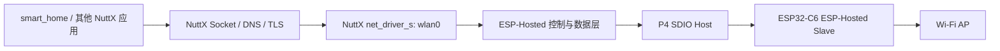

# ESP32-P4X Smart Home 板载 C6 Wi-Fi 接入方案

> 状态（2026-09-13）：基础 SDIO 枚举已有一次实板成功记录，重复启动待验证。
> 当前未注册 `wlan0`，未实现 CMD53 数据收发与 ESP-Hosted 协议握手，W1 尚未完成。
> 阶段记录见[板载 C6 SDIO 基础枚举](../开发日志/ESP32-P4X-C6-SDIO基础枚举阶段记录.md)。
>
> 适用对象：ESP32-P4X-Function-EV-Board、板载 ESP32-C6-MINI-1、Smart Home。

## 1. 目标

在不改变 SC2336 摄像头、DSI 显示和板载 Ethernet 的前提下，使 OpenVela/NuttX
运行于 ESP32-P4 的 Smart Home 通过板载 ESP32-C6 接入 WPA2/WPA3 Wi-Fi，向 NuttX
注册 `wlan0`，并完成：

```text
扫描 AP → 配置凭据 → 关联 → DHCP → DNS → TLS → Smart Home 模型请求
```

目标是网络栈中的标准 WLAN 接口，而不是在应用中直接向 C6 发送 AT 命令。完成后
Smart Home、摄像头服务和其他 NuttX 应用都可以通过 `wlan0` 使用网络。

## 2. 官方方案与本项目选择

ESP32-P4 不带原生 Wi-Fi/Bluetooth 射频；Function EV Board 上的
ESP32-C6-MINI-1 是官方配置的 Wi-Fi/Bluetooth 协处理器。官方推荐 P4 作为
Host、C6 作为 Slave，二者通过板上已布线的 SDIO 连接，并使用 ESP-Hosted。

- P4 Wi-Fi 扩展说明：
  <https://docs.espressif.com/projects/esp-idf/en/stable/esp32p4/api-guides/wifi-expansion.html>
- Function EV Board 硬件说明：
  <https://docs.espressif.com/projects/esp-dev-kits/en/latest/esp32p4/esp32-p4-function-ev-board/user_guide.html>
- ESP-Hosted P4/C6 组件说明：
  <https://components.espressif.com/components/espressif/esp_hosted/versions/2.9.1/readme?language=en>
- 官方 C6 SDIO Slave 示例和默认线路：
  <https://components.espressif.com/components/espressif/esp_hosted/versions/2.9.7/examples/slave?language=en>

官方 ESP-IDF Host 方案使用 `esp_wifi_remote` 和 `esp_hosted` 组件，C6 运行
ESP-Hosted Slave 固件。该组件依赖 ESP-IDF、FreeRTOS、LwIP 和 Espressif 的
Wi-Fi API，不能直接通过 `CONFIG_ESPRESSIF_WIFI=y` 复用到 P4 NuttX：当前
NuttX 的该配置符号只适用于具备原生 Wi-Fi 的 ESP32-C3/C6。

因此本项目的首轮实现保持 P4 私有：保留官方 C6 Slave 固件和 P4↔C6 的
SDIO/ESP-Hosted 协议，在 `chips/esp32p4` 与 P4X 板级目录实现传输、协议和
`net_driver_s` 适配。接口经过至少两个板级实现验证前，不新增通用
`drivers/nuttx/drivers/wireless/esp_hosted/` 驱动。后续若确有复用需求，再从
已验证的 P4 私有实现中抽取不含 GPIO、复位时序和控制器寄存器的公共部分。



## 3. 范围和非目标

本期包含：

- 板载 C6 的 SDIO 传输、复位、就绪和版本协商；
- ESP-Hosted 控制面：能力查询、扫描、STA 配置、关联/断连和事件；
- ESP-Hosted 数据面：收发以太网帧并注册 NuttX `wlan0`；
- WPA2-PSK 为首个实板验收目标，后续按 C6 固件能力扩展 WPA3；
- DHCP、DNS、TLS 与 Smart Home 云端模型闭环；
- 凭据从 `/data/wifi.conf` 或等价的 LittleFS 私有配置读取，不编入 defconfig、
  源码或串口日志。

本期不包含：

- 更换为 Wi-Fi AT、串口透传或应用私有网络协议；
- C6 侧 BLE、Thread、SoftAP、Mesh、网络桥接或低功耗网络分片；
- 让 C6 摄像头编解码、显示或承载 Smart Home 应用；
- 将 Ethernet 与 Wi-Fi 聚合、自动切换或双链路负载均衡；
- 在未验证的情况下宣称支持 WPA3、AP 模式或长期断线自动恢复。

## 4. 分层设计

### 4.1 ESP32-P4 芯片层

新增 P4 私有 SDIO Host 传输适配：

| 文件 | 职责 |
| --- | --- |
| `chips/esp32p4/common/espressif/esp_hosted_sdio.c`、`chips/esp32p4/include/esp_hosted_sdio.h` | 配置 SDIO Host、DMA 描述符、中断、流控和传输错误恢复 |
| `chips/esp32p4/common/espressif/Kconfig` | P4 SDIO/ESP-Hosted 传输能力和 DMA 依赖 |

芯片层只负责控制器能力和 SDIO 传输，不放入 C6 协议解释、SSID 或 DHCP 逻辑。
P4X 板的 P4 侧接线已经固定为 CLK=GPIO18、CMD=GPIO19、D0=GPIO14、
D1=GPIO15、D2=GPIO16、D3=GPIO17；GPIO54 复位 C6。C6 侧对应的 SDIO 引脚是
CLK=19、CMD=18、D0=20、D1=21、D2=22、D3=23，不能把 C6 GPIO 编号误写成
P4 GPIO 编号。

### 4.2 板级层

新增 `board/esp32p4/esp32p4-function-ev-board/src/esp32p4_hosted.c`：

- 定义本板 C6 enable/reset、SDIO 和可选 wakeup GPIO；
- 在 `esp_bringup()` 的明确阶段执行 `board_esp_hosted_initialize()`；
- 创建 P4 私有传输与协议实例，并把它绑定给私有 WLAN 适配；
- 在成功时注册 `wlan0`，失败时记录具体阶段和 errno，不影响 `eth0`、显示和摄像头。

相应更新 `board.h`、板级 `Kconfig`、`src/Make.defs` 与 `src/CMakeLists.txt`。
板级持有本板线路、复位时序和装配顺序；协议与网络适配暂不从 P4 私有目录上提。

### 4.3 应用层

`smart_home` 不拥有 `wlan0`。新增的网络配置服务只负责：

1. 在启动时检查 Wi-Fi 服务已注册；
2. 从 `/data/wifi.conf` 读取 SSID、认证方式和密码；
3. 请求关联并等待受限超时；
4. 对 `wlan0` 调用标准 DHCP 与 DNS 路径；
5. 将脱敏的关联状态、IPv4、DNS 状态更新到 UI。

应用不得保存或打印明文密码。模型 Tool 不应读取、修改或回显 Wi-Fi 凭据。

## 5. 配置与凭据

以下名称是本项目拟新增的配置方向，不是当前已经存在的 Kconfig 符号：

```ini
# 板级 C6 / ESP-Hosted 开关
CONFIG_ESP32P4_FUNCTION_EV_BOARD_ESP_HOSTED=y
CONFIG_ESP32P4_FUNCTION_EV_BOARD_ESP_HOSTED_STA=y

# P4 私有 SDIO 传输
CONFIG_ESPRESSIF_HOSTED_SDIO=y

# NuttX 网络能力
CONFIG_NET=y
CONFIG_NET_IPv4=y
CONFIG_NET_TCP=y
CONFIG_NET_UDP=y
CONFIG_NETUTILS_DHCPC=y
CONFIG_NETDB_DNSCLIENT=y
```

首期不要求 `wapi` 命令。待 `wlan0` 的 Wireless Extensions ioctl 映射经过实板验证后，
再按需开启：

```ini
CONFIG_WIRELESS_WAPI=y
CONFIG_WIRELESS_WAPI_CMDTOOL=y
```

这避免先编译出一个命令、却没有可工作的无线 netdev。`ifup`/`ifdown`、`ifconfig`
和 `renew` 作为通用网络诊断命令，需要对应 NSH、procfs 与 DHCP 配置。

Wi-Fi 配置建议采用如下格式，并由 LittleFS 资源生成脚本在显式启用时才打包：

```json
{
  "version": 1,
  "interface": "wlan0",
  "ssid": "example-ssid",
  "security": "wpa2-psk",
  "password": "replace-at-deployment"
}
```

默认资源镜像不应包含该文件；首次联网可经物理串口受控写入，或使用专门的、
受认证的本地配置流程。配置读取日志只允许输出 SSID 长度、认证类型和结果码。

## 6. 分阶段实施

### W0：固定官方基线

记录 P4X 板硬件版本、P4 revision、C6 ESP-Hosted Slave 固件版本、ESP-Hosted
组件版本和 SDIO 配置。先使用官方 ESP-IDF P4/C6 ESP-Hosted 示例独立验证：

```text
P4 ↔ SDIO ↔ C6：版本协商成功
C6：能够扫描并关联 AP
P4：能够通过该链路获得 IP 或完成 iperf
```

该步骤只验证硬件与官方固件组合，不能当作 OpenVela 适配完成。

### W1：OpenVela SDIO 传输

实现 P4 SDIO Host 初始化、C6 reset/ready 时序、控制包收发和错误统计。验收要求：

- C6 能力与版本查询成功；
- 连续控制包收发无超时；
- 对 C6 复位、SDIO 超时和 CRC/长度异常能释放等待者并可重新初始化；
- 不注册 `wlan0`，不进入 DHCP。

### W2：控制面与 `wlan0`

实现扫描、STA 配置、关联、断连和事件，并由数据面将 C6 接收到的二层帧交给
NuttX 网络栈。验收要求：

```text
nsh> ifconfig
... wlan0 出现且 link 状态正确
nsh> ifup wlan0
nsh> renew wlan0
nsh> ifconfig wlan0
```

通过条件是 `wlan0` 获得非零 IPv4、网关和 DNS。SSID 错误、密码错误、AP 不可见和
DHCP 超时必须产生不同的错误码或可区分日志。

### W3：Smart Home 云端闭环

关闭 `CONFIG_SMART_HOME_DEMO_OFFLINE_UI`，使应用使用标准网络模块。验收要求：

- UI 显示 Wi-Fi 已关联、IP 和 DNS 状态；
- DNS 解析模型 endpoint 成功；
- 一条脱敏模型 Tool 调用成功；
- 缺少 `/data/wifi.conf` 时仍可启动本地 UI，并明确显示网络未配置。

### W4：与摄像头和 Ethernet 共存

依次验证：

1. Wi-Fi + Smart Home；
2. Wi-Fi + `/dev/video0` + `video_test 300`；
3. Wi-Fi + DSI/LVGL + 摄像头预览；
4. 同时存在 `eth0` 与 `wlan0` 时的默认路由策略。

首期可以规定“Ethernet 优先，Wi-Fi 仅在 Ethernet 无链路时使用”，但必须在网络栈中
明确路由策略后才实现；不能依赖接口初始化先后顺序碰巧决定默认路由。

## 7. 风险和定位

| 现象 | 优先检查 | 禁止的误判 |
| --- | --- | --- |
| 没有 `wlan0` | 板级开关、C6 ready、SDIO 枚举、Hosted 版本协商 | 仅开启 WAPI 命令即可联网 |
| 控制包超时 | C6 固件版本、SDIO 时钟/宽度、reset 时序、DMA/中断 | 归因于 DHCP 或模型 API |
| 能扫描但不能关联 | 认证模式、密码、地区/信道、C6 事件码 | 伪报“Wi-Fi 已连接” |
| 已关联却无 IP | DHCP、路由器 VLAN、NuttX UDP/DHCP 配置 | 修改 CSI 或显示代码 |
| 有 IP 但模型不可用 | DNS、TLS 时间/证书、endpoint、密钥配置 | 重置 C6 作为首选动作 |
| 摄像头开启后不稳定 | PSRAM 余量、DMA、线程优先级、SDIO/CSI 并发 | 把每次问题都归为 Wi-Fi 信号 |

## 8. 提交与验收纪律

每个阶段必须是可构建、可验证的功能单元：

| 提交阶段 | 最低验证 |
| --- | --- |
| W1 | P4 构建通过，实板 CMD0/CMD5/CMD52 与 C6 握手日志成功 |
| W2 | `wlan0`、关联、DHCP 和 DNS 实板日志成功 |
| W3 | Smart Home 脱敏模型 Tool 调用成功 |
| W4 | `video_test 300` 与 Smart Home Wi-Fi 共存复测成功 |

失败后的补丁不单独作为“尝试修复”提交；应在同一工作区继续定位，直到对应阶段有
可复核的构建和实板证据后再提交。
